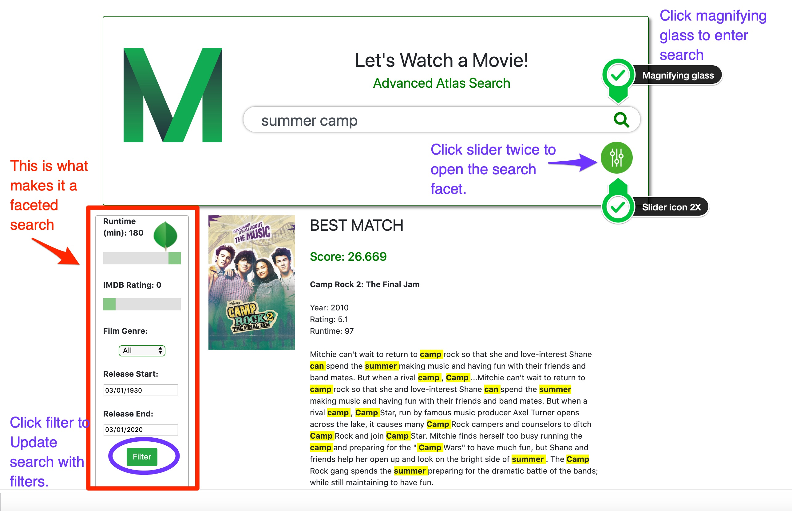

# AtlasFacetedMovieSearch
Application to demonstrate Atlas Search GA features including numbers and dates on the sample_mflix database

To enter the search query, you MUST hit the magnifying glass icon to the right in the search bar.

To open up the facet option, you must hit the slider icon TWICE. Please refer to image below.

This app points to this GET API in one of my clusters: webhook_url = 'https://webhooks.mongodb-stitch.com/api/client/v2.0/app/ftsdemo-flweq/service/movies-fuzzy-FTS/incoming_webhook/movies-fuzzy-FTS'; The GET API code is posted in this repo, as well. 

